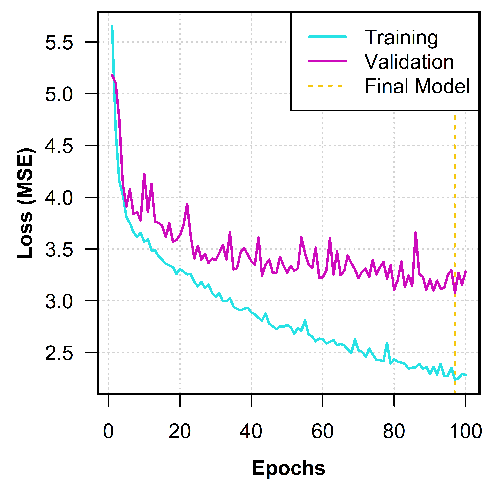
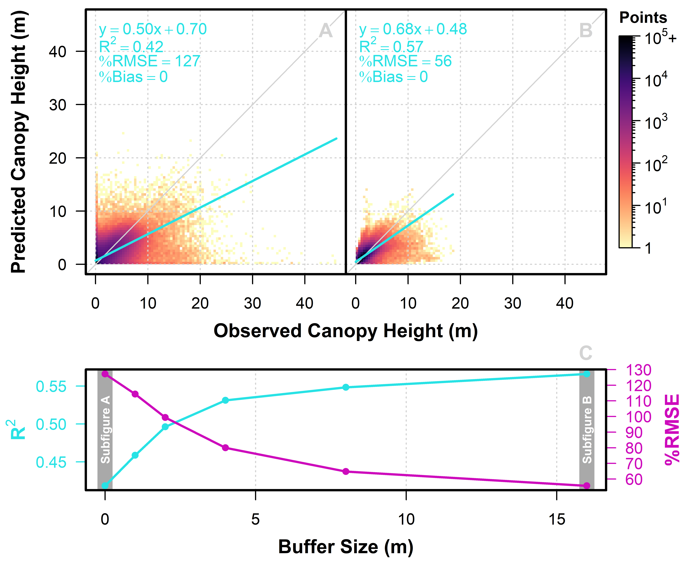

# U-Net CNN for Woodland Canopy Height Mapping

Author: Mickey Campbell

Affiliation: University of Utah

Date: 14 April 2025

## Summary

The two Python scripts in this repository ([unet_train.py](unet_train.py) and [unet_predict.py](unet_predict.py)) were created to enable modeling and mapping (i.e., making spatially explicit predictions) of tree canopy height using a U-Net convolutional neural network (CNN). They were written in support of a manuscript, currently under review, that seeks to develop a robust, repeatable, and broadly applicable workflow for mapping woodland vegetation structure (canopy cover, aboveground biomass, and tree density).

## Background

Airborne lidar is the gold standard for vegetation structure mapping on broad spatial scales; however its spatiotemporal availability is limited. In the contiguous US, the National Agricultural Inventory Program (NAIP) collects high-resolution (i.e.., 0.3 - 0.6m) aerial imagery every few years on a statewide basis. CNNs are a widely used type of computer vision algorithm that leverages the color, shape, size, texture, and context information within image data to recognize patterns and use those patterns for predictive purposes. Indeed, CNNs have been shown recently to be useful for predicting vegetation height from high-resolution remotely sensed imagery.

## Objective

By training and validating a CNN model with a U-Net architecture on lidar-derived canopy heights (response variable) and NAIP aerial imagery (predictor data), we sought to map canopy height across diverse portions of the vast piñon-juniper (PJ) woodland ecosystem of the Southwestern US.

## Methods

We gathered lidar and NAIP data from 100 PJ-dominant sites, each 3x3 km in size, around the western US, and randomly split them into training (60), validation (20), and test (20). Lidar canopy height model (CHM) and NAIP imagery were split into 256x256 pixel tiles, with 16-pixel overlap, yielding 400 image chips for each site (24000 training, 8000 validation, and 8000 test chips in total). A U-Net model was built using the `tensorflow.keras` API (see details in [unet_train.py](unet_train.py) and ***Figure 1*** below).


***Figure 1.** U-Net architecture.*

## Results

The model was run for 100 epochs, reaching minimum validation loss on the 97th epoch, with a validation MSE of approximately 3.1 m<sup>2</sup> (***Figure 2***).



***Figure 2.** Training and validation loss.*

We compared CHM predictive performance with 50000 random points in each of the 20 test sites (1M points total). We extracted pixel-level predicted and observed CHM values. We also generated a series of buffers around each sample point, investigating the degree to which broader-scale spatial patterns in canopy height were captured by the model. At the individual pixel level, the model yielded an R<sup>2</sup> of 0.42 between predictions and observations with an average predictive error (RMSE) of 1.56m (***Figure 3A***). Within a buffer size of 16m, the R<sup>2</sup> increased to 0.57 and the RMSE decreased to 0.68m (***Figure 3B***).



***Figure 3.** Multi-scale model performance against test data. (A) Performance at the individual pixel level. (B) Performance within a 16m-buffer area around each sample point. (C) Performance across varying buffer sizes.*

The predictions and observations for an example test area can be seen below:


***Figure 4.** Mapped predictions for example test area.*

## Running the Scripts

[unet_train.py](unet_train.py) and [unet_predict.py](unet_predict.py) were built with the following packages and versions:

- `numpy 1.22.4`
- `rasterio 1.3.10`
- `tensorflow 2.7.0`
- `tensorflow_addons 0.15.0`
- `tensorflow_gpu 2.7.0`
- `arcpy 3.2.0`

### 1. Data preparation

To run these scripts, you need two main datasets: (1) 4-band (RGB and NIR) NAIP aerial imagery; and (2) a canopy height model (perhaps derived from airborne lidar). Both need to be at the same spatial resolution, aligned to the same pixel grid, and with the same coordinate reference system and datum. To work with the existing script without modification, these datasets need to be tiled into 256x256 pixel chips. In its current form, the scripts assume the following directory structure:

```
project_dir/
├── data_dir/
│   ├── train/ # where training data are stored
|       ├── naip/
|       ├── chm/
│   ├── valid/ # where validation data are stored
|       ├── naip/
|       ├── chm/
│   ├── test/ # where test data are stored
|       ├── naip/
|       ├── chm/
├── model_dir/ # where model outputs will be placed
│   ├── pred_dir/ # where model predictions will be placed
```

### 1. Training the U-Net model with [unet_train.py](unet_train.py)

To train a model, you will need to edit the main block within the script to suit your needs and data structures. The model can be run in two modes: (1) tuning mode (`run_mode == "tune"`); or (2) final model construction mode (`run_mode == "final"`). In its current form, the two editable tuning parameters are the batch size (`batch_sizes`) and whether or not to randomly augment 50% of the training and validation data (`augment_flags`). You can use a subsample of your data for more efficient tuning (`use_sample == T` and `sample_proportion`). You should also define the number of `total_epochs`, your `data_dir`, and your `model_dir`. If run successfully, the model will be saved as an HDF5 file in `model_dir`, along with a CSV that tracks training and validation loss. Note that if model training is interrupted, the script will automatically resume training where it left off.

### 2. Making predictions with the U-Net model [unet_predict.py](unet_predict.py)

To make per-pixel canopy height predictions based on NAIP image data, you have two options: (1) use the existing model created in this study [unet_model.h5](models/unet_model.h5); or (2) use a model you trained with [unet_train.py](unet_train.py). In either case, you will need to define the directory where your test data are stored (or some other directory of NAIP imagery, tiled into 256x256 pixel chips) (`test_dir`), the directory where to intend to store the canopy height predictions (`pred_dir`), and the HDF5 U-Net model file (`model_file`).

In its current form, the script performs a tile mosaicking procedure using `arcpy`. Given that `arcpy` is not open-source, and given that the `mosaic_tiles()` function is catered very specifically to the file naming convention used in our study, you may opt to use your own mosaicking procedure and simply eliminate the `mosaic_tiles()` function from the main block.
